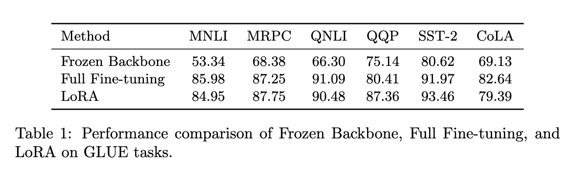
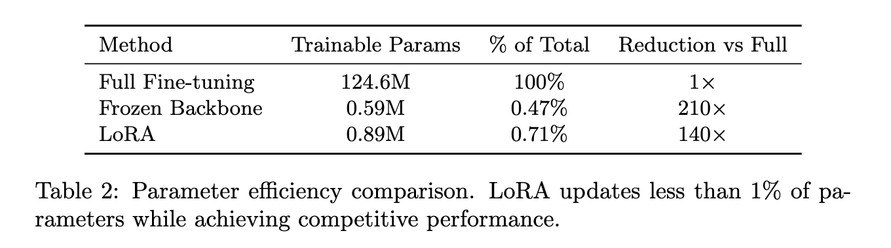
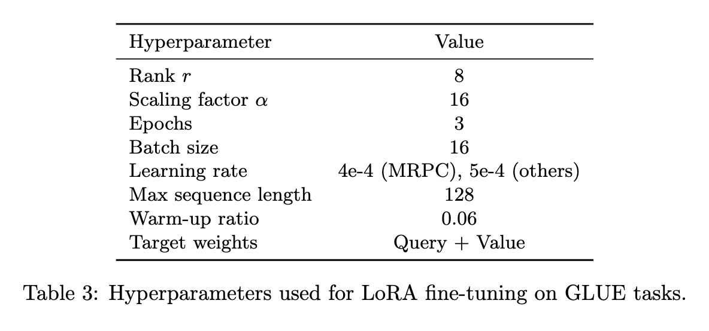
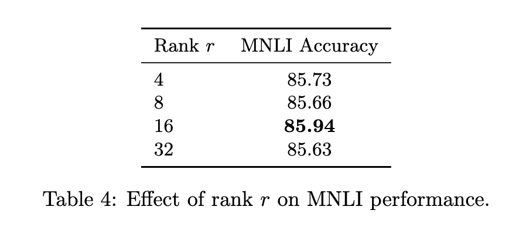
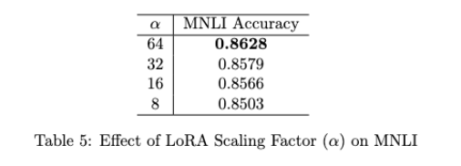
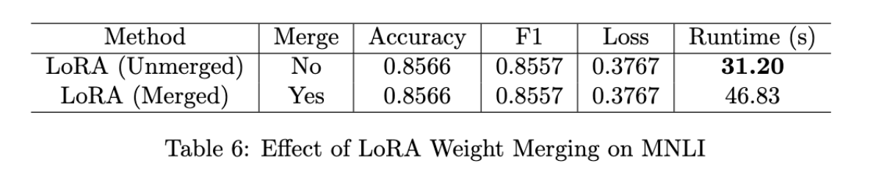

# LoRA on GLUE: Results Summary

This project focuses on evaluating LoRA on GLUE tasks, with three main goals:
- Compare LoRA against Full Fine-tuning and a Frozen Backbone baseline
- Measure parameter efficiency
- Analyze the impact of MNLI hyperparameters (`rank`, `alpha`) and weight merging

## 1) Overall Performance on GLUE

Key findings:
- LoRA achieves performance close to, and sometimes better than, Full Fine-tuning on multiple tasks.
- LoRA is the best method on `MRPC`, `QQP`, and `SST-2`.
- Full Fine-tuning is slightly better on `MNLI`, `QNLI`, and `CoLA`, but the gap is small.
- Frozen Backbone consistently underperforms, showing the limits of training only the classifier head.

## 2) Parameter Efficiency

Key findings:
- Full Fine-tuning uses about `124.6M` trainable parameters (100%).
- LoRA uses only about `0.89M` trainable parameters (`0.71%`), a roughly `140x` reduction vs Full.
- Frozen Backbone is even smaller (`0.59M`, `0.47%`) but suffers clear drops in accuracy and F1.
- Overall, LoRA provides the best balance between effectiveness and efficiency.

## 3) LoRA Hyperparameters Used

Main settings used in this study:
- `rank r = 8`
- `alpha = 16`
- `epochs = 3`
- `batch size = 16`
- `max sequence length = 128`
- `target weights = Query + Value`

## 4) Effect of Rank on MNLI

Key findings:
- In this sweep, `r=16` performs best (MNLI accuracy `85.94`).
- Results for `r=4/8/32` are very close, suggesting rank has limited impact in this range.
- Increasing rank does not guarantee monotonic improvement.

## 5) Effect of Alpha on MNLI

Key findings:
- Accuracy improves steadily as alpha increases from `8` to `64`.
- `alpha=64` gives the best MNLI accuracy in this experiment (`0.8628`).
- A larger LoRA scaling factor can help, but task-level tuning is still recommended.

## 6) Weight Merging Consistency (MNLI)

Key findings:
- Unmerged and merged models have identical core metrics: `Accuracy=0.8566`, `F1=0.8557`, `Loss=0.3767`.
- This confirms metric consistency before and after LoRA weight merging in this setup.
- Runtime is slightly higher for the merged run in this record (`46.83s` vs `31.20s`), but the main conclusion (metric equivalence) still holds.

## Final Takeaway

- LoRA delivers near-Full-Fine-tuning performance on GLUE with far fewer trainable parameters.
- On MNLI, `alpha` has a clearer impact than `rank` within the tested ranges.
- Metrics remain consistent before and after merging, supporting merged-weight deployment.