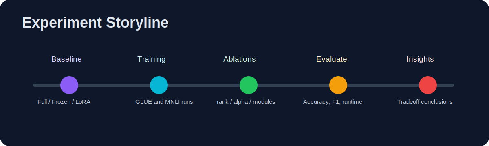

# LoRA on GLUE: Re-Implementation Summary

This project evaluates **LoRA (Low-Rank Adaptation)** on GLUE with three goals:
- Compare `LoRA` vs `Full Fine-tuning` vs `Frozen Backbone`.
- Measure the **performance-efficiency tradeoff**.
- Study MNLI sensitivity to LoRA settings (`rank`, `alpha`, target modules, and merge behavior).

---

## Quick Navigation
- [A) Results Snapshot](#a-results-snapshot)
- [B) Reproduction Workflow](#b-reproduction-workflow)
- [C) Final Takeaways](#c-final-takeaways)

---

## A) Results Snapshot

### 1) Overall Performance on GLUE

Key findings:
- LoRA is close to, and sometimes better than, Full Fine-tuning on multiple tasks.
- LoRA is best on `MRPC`, `QQP`, and `SST-2`.
- Full Fine-tuning is slightly better on `MNLI`, `QNLI`, and `CoLA`, but margins are small.
- Frozen Backbone underperforms, showing the limit of training only the classifier head.

### 2) Parameter Efficiency

Key findings:
- Full Fine-tuning: `124.6M` trainable params (100%).
- LoRA: `0.89M` trainable params (`0.71%`), around `140x` fewer than Full.
- Frozen Backbone: `0.59M` (`0.47%`) but with clear performance drop.
- LoRA gives the strongest balance of effectiveness and efficiency.

### 3) LoRA Hyperparameters Used

Main settings:
- `rank r = 8`
- `alpha = 16`
- `epochs = 3`
- `batch size = 16`
- `max sequence length = 128`
- `target modules = query + value`

### 4) Effect of Rank on MNLI

Key findings:
- `r=16` performs best in this sweep (MNLI accuracy `85.94`).
- `r=4/8/32` are very close, so rank impact is limited in this range.
- Larger rank does not guarantee monotonic gains.

### 5) Effect of Alpha on MNLI

Key findings:
- Accuracy improves as alpha increases from `8` to `64`.
- `alpha=64` is best in this experiment (`0.8628`).
- Scaling factor matters, but per-task tuning is still important.

### 6) Weight Merging Consistency (MNLI)

Key findings:
- Unmerged and merged models produce identical core metrics: `Accuracy=0.8566`, `F1=0.8557`, `Loss=0.3767`.
- This supports metric consistency before/after LoRA merge.
- Runtime is slightly higher for merged in this record (`46.83s` vs `31.20s`), but the main conclusion is unchanged.

### 7) Effect of Target Modules on MNLI

Key findings:
- `query` only is weakest (`81.43%` accuracy).
- Adding `value` gives a strong improvement (`84.92%`).
- Best result uses `query + value + key + dense` (`85.92%` accuracy, `85.83%` F1).
- Adapting more attention-related modules helps, with diminishing returns.

### 8) Parameter and Runtime Cost of Target Modules

Key findings:
- `Q` is lightest (`0.74M`) but weakest in performance.
- `Q+V` increases params to `0.89M` with meaningful accuracy gain.
- `Q+V+K+D` is largest (`1.18M`) but still under `1%` of full model.
- Runtime increases modestly with more adapted modules.
- In practice: `Q+V` is a strong middle ground; `Q+V+K+D` is best if quality is the priority.

---

## B) Reproduction Workflow

---

## C) Final Takeaways

- LoRA delivers near-Full Fine-tuning performance on GLUE with dramatically fewer trainable parameters.
- On MNLI, `alpha` shows a clearer impact than `rank` in the tested ranges.
- Merged and unmerged LoRA weights are metric-consistent in this setup, supporting deployment with merged weights.
